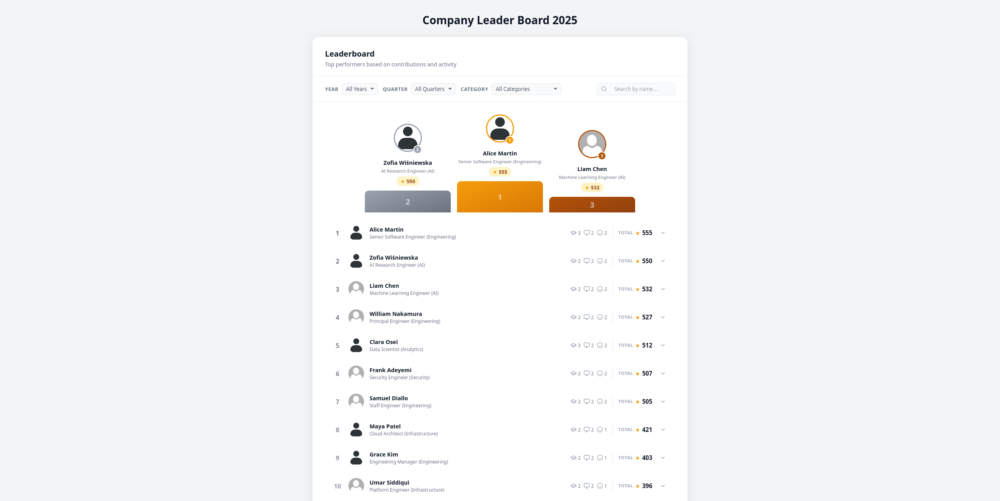
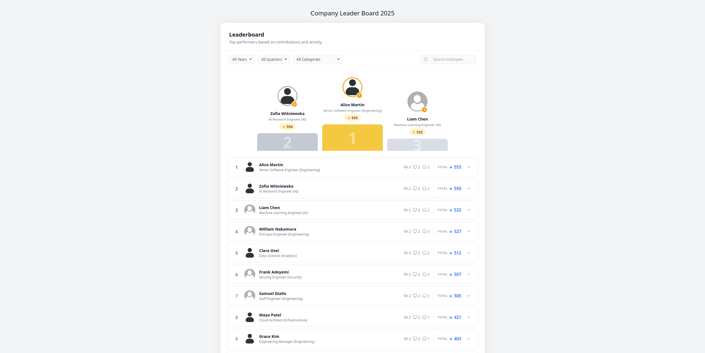
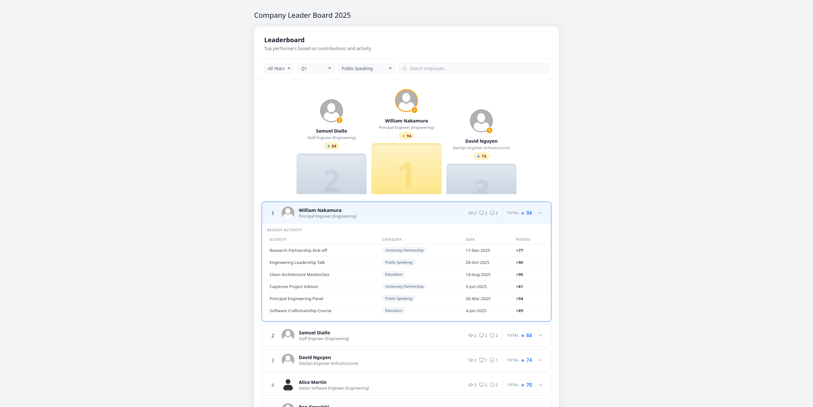

# Task 1 : The Clone Wars

## Data safeguards

### Manual work

Not everything needs to be delegated to AI. Some things can and should be done manually.

First, image replacement. Using browser html inspector, inspect the "podium" avatars and leaderboard avatars. Notice similar classes and ther styles:

- Podium: `.podiumAvatar_2943a085`
- Leaderboard: `.avatar_2943a085`

Manually edit the css for both:

```css
background-image: url("https://www.svgrepo.com/show/452030/avatar-default.svg") !important;
background-color: grey;
```

I was going to use `filter:blur(10px);` initially, but that looked worse and would likely produce worse results downstream.

### AI assisted work

I got lazy pretty quick.

Name replacement could also bedone manully, but instead I turned to AI for as small script.

Once again using the html inspector I find the classes of "podium" and leaderboard names (`podiumName_2943a085`, `.name_2943a085`) and promt the AI this:

> write a js script to update html element content by classname

Output

```js
function updateByClass(className, content) {                                  
  document.querySelectorAll(`.${className}`).forEach(el => {
    el.textContent = content;
  });
}
```

After validating the script, I run it to replace the PII with generic data.

- `name_2943a085`
- `podiumName_2943a085`
- `activityName_2943a085`
- `role_2943a085`
- `podiumRole_2943a085`

Also, I remove the feedback sticky thingie at the bottom right of the page in HTML for less distractions.

Now I can take the scrrenshots.

## Task Definition

Clear goal and path to that goal is a must when working with AI, so lets do a task definition now.

I'm going to abridge my thought process for the sake of time.

My initial plan: [initial_instructions.md](./docs/initial_instructions.md)

Prompt to ai for review:

```
Review the design plan for re-creating the company leaderboard. Improve description for better insctructions where needed
```

AI-reviewed plan: [reviewed_instructions.md](./docs/reviewed_instructions.md)

next prompt:

```
create a company leaderboard page based on instructions provided in @docs/reviewed_instructions.md
```

- the agent spun for > 1000 seconds. aborted the execution and went with another aproach

```
split the work defined in the file into multiple small-scale tasks. create a file for each taskithin the `docs` folder
```

it created 7 tasks

```
start executing the tasks you just defined in order
```



```
update the page design based on @design/page_top.png
current layout: @results/result_1.png
- Title position
- Filter bar layout
- podium styles
- leaderboard row styles
```



```
current layout: @results/result_2.png 
changes to be made: 
- Podium
  - styles updates: closer to @design/podium.css  
  - star counter - should be gold only for #1
  -  
- document header - align with left border of content card
- search bar - take all available space, fully hide the search icon on focus/hover
- filters
  - remove records without any stars from both podium and list
- user activity
  - reference image: @design/expanded_user_activity.png  
  - blue outline on the whole expanded row
  - remove coloring from categories
  - add color to points
  - format date like on screenshot - month format change
```



at this point (or even one step before) I could and perhaps should have done some manual edits, but instead I continued prompting

```
- set the leaderboard container max width to 1236px to be closer to the mockup
- podium updates
  - 2nd and 3rd place star counter - white background, blue icon and number
  - fix podium number clipping
  - position number in the avatar should be `#eab308` for 1st, `#94a3b8` for 2nd and `#92400e` for 3rd place
- filter section
  - should have the same style as on @design/filters.png - on its own "card"
- leaderboard changes
  - dropdown shevron - blue color, curcular round blue background
  - total score - position `total` above score counter
  - category counters - position icons above counters, set icon color to blue, update public speaking icon to be closer to mockup, add on hover tooltip to the icon with icon label (category name)
  - date - 2 digit month day (e.g. `08-Sep-2025` instead of `8-Sep-2025`)
  - user row should remain white when opened, activity table should have `#f8fafc` background. activity row should have `#f1f5f9` color on hover
```

this produced a good enough result you can see by running the app
